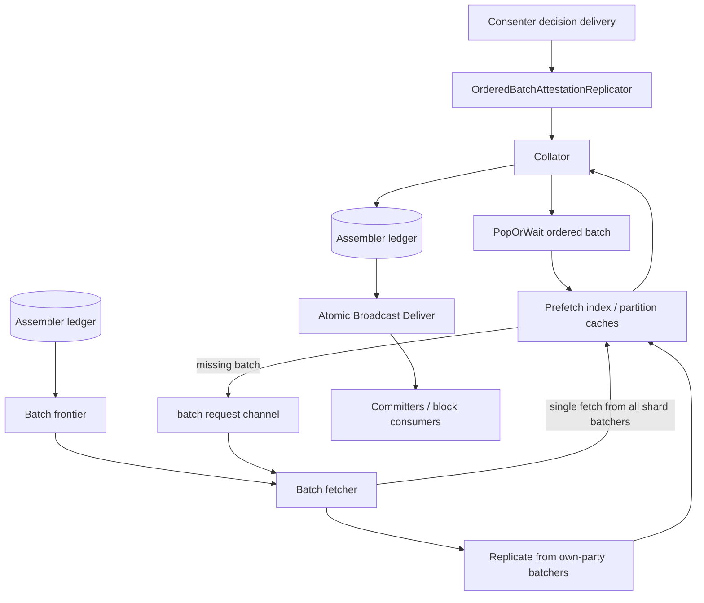

<!--
Copyright IBM Corp. All Rights Reserved.

SPDX-License-Identifier: Apache-2.0
-->
# Assembler Service

1. [Overview](#1-overview)
2. [Core Responsibilities](#2-core-responsibilities)
3. [Configuration](#3-configuration)
4. [Workflow Details](#4-workflow-details)
5. [APIs and Interfaces](#5-apis-and-interfaces)
6. [Metrics and Monitoring](#6-metrics-and-monitoring)
7. [Failure and Recovery](#7-failure-and-recovery)
8. [Implementation Details](#8-implementation-details)

## 1. Overview

Assemblers are downstream block-production nodes. They consume ordered available common blocks from consenters, fetch the referenced transaction batches from batchers, collate metadata with payloads, append Fabric-compatible blocks to the assembler ledger, and serve Fabric Atomic Broadcast `Deliver`.

Assemblers do not run consensus and do not accept transaction broadcast. Routers accept client transactions; consenters order metadata; assemblers build and deliver final common blocks.

Read the chart as two incoming streams that meet inside the collator. The first stream starts at consenter decision delivery and produces ordered batch attestations. This stream defines final order. The second stream starts at the assembler ledger frontier and batch fetcher, then fills the prefetch index with payload batches replicated from batchers. This stream supplies data needed to materialize that order.

The prefetch index is the join point between ordered metadata and payload availability. The collator calls `PopOrWait` for the next ordered batch. If replication has already cached the batch, collation can continue immediately. If the batch is missing, the index emits a request to the fetcher, which asks all batchers in the shard for that specific sequence and inserts the first matching result back into the index.

The ledger is both output and recovery input. During normal operation, collator appends data blocks and config blocks to the assembler ledger. During restart or reconfiguration, existing ledger contents determine the batch frontier so replication resumes after batches already materialized into blocks. This prevents duplicate block append while still allowing missing future batches to be fetched.

Delivery is last step. Committers and other consumers read from assembler `Deliver`, not from consenters or batchers. By the time a block is served, ordering metadata from consensus and payload data from batcher storage have already been combined into Fabric-compatible block form.

## 2. Core Responsibilities

The assembler converts ordered metadata into the final block ledger. Its job begins only after consensus establishes batch-attestation order; it does not choose order and does not decide transaction validity. It waits for payloads, preserves ordered sequence, and writes blocks that downstream committers can validate and commit.

1. **Initialize ledger state:** Open assembler ledger, append genesis block when bootstrapping from genesis, and recover transaction/block counters.
2. **Recover batch frontier:** Scan persisted blocks to find next needed batch sequence per shard/primary.
3. **Replicate batch payloads:** Pull batch streams from the assembler party's batchers for each shard and primary channel.
4. **Fetch missing batches on demand:** When collator needs a batch absent from cache, request a single-batch fetch from all batchers in the shard and use the first matching response.
5. **Consume ordered attestations:** Read ordered batch attestations/available common blocks from consenter delivery.
6. **Collate in order:** Wait for referenced batch payloads, then append data blocks to the assembler ledger with ordering metadata.
7. **Handle config blocks:** Append config blocks directly, soft-stop assembly, and dynamically restart when config can be applied locally.
8. **Serve block delivery:** Expose Fabric Atomic Broadcast `Deliver` over the assembler ledger.

## 3. Configuration

Assembler-local configuration starts in `config.NodeLocalConfig` and is translated into `node/config.AssemblerNodeConfig`.

Common settings:

- `General.ListenAddress` and `General.ListenPort`: assembler gRPC bind address.
- `General.MonitoringListenAddress` and `General.MonitoringListenPort`: Prometheus/metrics endpoint; monitoring address defaults to listen address when empty.
- `General.TLS`: server TLS and optional client authentication for delivery.
- `General.Bootstrap`: bootstrap/config block source.
- `General.LocalMSPDir` and `General.LocalMSPID`: local identity material.
- `General.MetricsLogInterval`: periodic metrics logging; `0` disables periodic log output.
- `FileStore.Path`: assembler ledger directory.

Assembler-specific settings:

- `Assembler.PrefetchBufferMemoryBytes`: per-partition prefetch cache memory budget.
- `Assembler.RestartLedgerScanTimeout`: timeout for ledger scan used to compute batch frontier on restart/reconfig.
- `Assembler.PrefetchEvictionTtl`: TTL for cached prefetched batches.
- `Assembler.PopWaitMonitorTimeout`: timeout used by partition index to monitor long waits in `PopOrWait`.
- `Assembler.ReplicationChannelSize`: buffer size for replicated batch streams.
- `Assembler.BatchRequestsChannelSize`: channel size for on-demand batch fetch requests from index to prefetcher.

The prefetch and channel settings control cache memory, eviction, wait monitoring, replication buffering, and the size of the on-demand request queue. They do not impose a hard concurrency limit on on-demand fetches, and they do not change ordering; consenter decisions define order.

## 4. Workflow Details

### Step 1. Construction and ledger initialization

`NewDefaultAssembler` checks that the supplied config block and header are present, opens the assembler ledger, creates metrics, initializes ledger state, builds prefetch/collation components, starts metrics, and returns the assembler.

`initLedger` behavior:

- If ledger has blocks, read the last block to initialize tx count and block count metrics.
- If ledger is empty and supplied config block is genesis (`block number == 0`), append it as the first assembler config block with genesis ordering metadata.
- If ledger is empty and supplied config block is non-genesis, do not append it; assembler starts from that config and relies on fetched/replicated data going forward.

`StartAssemblerService` separately creates the gRPC server, registers Fabric Atomic Broadcast, starts network serving, and marks node running.

### Step 2. Build runtime components from config

`initFromConfig` initializes assembly for the current config sequence:

1. Compute shard IDs and party IDs from assembler config.
2. Ask ledger for `BatchFrontier(shards, parties, RestartLedgerScanTimeout)`.
3. Create `PrefetchIndex` with one partition index per `(shard, primary)`.
4. Create `BatchFetcher` using the recovered frontier.
5. Create `Prefetcher` with shards, parties, index, and batch fetcher.
6. Create consenter-backed ordered attestation replicator through `ConsensusBringerFactory`.
7. Create `Collator` with shards, replicator, index, ledger, and config processor.
8. Start prefetcher and collator.

### Step 3. Batch replication and prefetch cache

`Prefetcher.Start` launches one replication goroutine per shard plus one goroutine for on-demand batch requests.

For replication, `BatchFetcher.Replicate(shardID)`:

- selects the batcher in the same party as the assembler for that shard;
- opens one deliver stream per primary party channel (`ShardPartyToChannelName(shard, primary)`);
- starts each stream from the recovered frontier sequence;
- converts received batcher blocks into `FabricBatch` values;
- sends batches into the prefetch index.

In steady state, only one primary stream per shard is expected to produce batches while other primary streams are mostly silent.

### Step 4. On-demand fetch for missing batches

The collator calls `PrefetchIndex.PopOrWait(batchID)` for each ordered batch. If the needed batch is not already cached, the partition index can emit the batch ID on `Requests()`: some cases request immediately, while ordinary waits are monitored and can request later after `PopWaitMonitorTimeout`.

`Prefetcher.handleBatchRequests` receives those IDs and calls `BatchFetcher.GetBatch(batchID)`. `GetBatch`:

- finds the shard in config;
- queries every batcher in that shard in parallel for the specific batch sequence;
- cancels remaining pulls after the first matching batch is found;
- returns an error if all batchers answer with non-matching batches, or if assembler shutdown cancels the operation; failed/invalid pulls currently send nil responses and can panic before a clean "not found" error path.

Returned batches are inserted with `PutForce`, bypassing normal prefetch eviction decisions for that needed batch.

### Step 5. Collation and ledger append

`Collator.Run` starts a goroutine reading `OrderedBatchAttestationReplicator.Replicate()`.

For each ordered item:

- If shard is `ShardIDConsensus`, item is a config block. The collator appends it with `Ledger.AppendConfig`. If its block number is newer than assembler's current config block number, it starts config processing and exits the collator loop.
- Otherwise, collator waits for matching batch via `Index.PopOrWait`, then appends data block and ordering information with `Ledger.Append`.

A canceled pop during stop exits cleanly. Unexpected batch fetch/collation failures panic.

### Step 6. Deliver service

`Assembler.Deliver` delegates to `AssemblerDeliverService.Deliver`.

The deliver service:

- builds a `deliver.Handler` over the assembler ledger;
- enforces TLS binding when `UseTLS && ClientAuthRequired`;
- checks `ChannelReaders` policy through `AssemblerSigFilter`;
- serves block responses for valid seek requests;
- waits if ledger height is zero before creating iterator.

`Assembler.Broadcast` returns an error (`"should not be used"`), and `AssemblerDeliverService.Broadcast` returns `"not implemented"`. Assemblers are delivery-only for clients.

### Step 7. Reconfiguration

Config blocks are delivered through the same ordered-attestation path using consensus shard ID.

When collator sees a newer config block:

1. Append config block to assembler ledger.
2. Launch `ProcessNewConfigBlock`.
3. Stop processing ordered attestations in current collator loop.

`ProcessNewConfigBlock`:

- calls `SoftStop` to stop prefetcher and collator while leaving delivery available;
- builds updated full configuration from config block;
- checks party eviction and local assembler identity/address/cert changes;
- if admin action is required, sets status to `StatePendingAdmin` and keeps delivery available;
- otherwise stops current network, reinitializes runtime components from new config, restarts assembler service, and marks node running.

## 5. APIs and Interfaces

Assemblers expose public block delivery and use internal orderer delivery/fetch paths.

Public API:

- Fabric Atomic Broadcast `Deliver`: registered by `StartAssemblerService`, served from assembler ledger.

Unsupported API:

- Fabric Atomic Broadcast `Broadcast`: always returns error.

Internal paths:

- Ordered attestation/common-block replication from consenters through `delivery.ConsensusBringerFactory`.
- Batch stream replication from same-party batchers through `BatchFetcher.Replicate`.
- Single-batch fetch from all shard batchers through `BatchFetcher.GetBatch`.
- Local ledger reader/writer used by collator, config handling, metrics, and deliver service.

Clients submit transactions to routers. Committers and other block consumers read blocks from assemblers.

## 6. Metrics and Monitoring

Assembler metrics are created in [`node/assembler/metrics.go`](https://github.com/hyperledger/fabric-x-orderer/blob/main/node/assembler/metrics.go). The monitoring endpoint uses translated `MonitoringListenAddress`.

Metric groups:

- assembler ledger metrics from `node/ledger`:
  - committed transaction count;
  - committed block count;
  - estimated committed block size;
- deliver metrics from `common/deliver` for deliver-service activity.

If `MetricsLogInterval > 0`, periodic logs emit total TXs, blocks, estimated block size, and interval deltas. On stop, logs emit final TX/block/size totals.

Use these metrics to distinguish ledger/write throughput and deliver activity. Current assembler metrics do not directly expose every prefetch-cache event; prefetch/index behavior is mainly visible through logs and tests.

## 7. Failure and Recovery

Assemblers persist final common blocks under `FileStore.Path`. On startup/reconfiguration, recovery comes from the assembler ledger:

- height and last block initialize block/transaction counters;
- `BatchFrontier` scans existing blocks to decide next batch sequence per shard/primary;
- genesis block is appended only when starting from empty ledger with genesis config block.

Batch replication resumes from recovered frontier. Missing ordered batches are fetched on demand from all batchers in the shard. A missing batch delays block append because ledger append order follows consenter order.

Stop behavior:

- `SoftStop` stops prefetcher and collator, sets `StateSoftStopped`, and leaves delivery service/network/ledger available.
- `Stop` stops assembly components if not already soft-stopped/pending-admin, stops metrics/network, closes ledger, marks stopped, and closes `mainExitChan`.

Config changes can be applied dynamically only when party is not evicted and local assembler node identity/address/cert change does not require admin action. Otherwise delivery remains available and node waits in pending-admin state.

## 8. Implementation Details

| Area | Source |
|------|--------|
| Assembler lifecycle, startup, reconfiguration, stop | [`node/assembler/assembler.go`](https://github.com/hyperledger/fabric-x-orderer/blob/main/node/assembler/assembler.go) |
| Deliver service and policy checks | [`node/assembler/assembler_deliver_service.go`](https://github.com/hyperledger/fabric-x-orderer/blob/main/node/assembler/assembler_deliver_service.go) |
| Collation and config-block handling | [`node/assembler/collator.go`](https://github.com/hyperledger/fabric-x-orderer/blob/main/node/assembler/collator.go) |
| Prefetch controller | [`node/assembler/prefetcher.go`](https://github.com/hyperledger/fabric-x-orderer/blob/main/node/assembler/prefetcher.go) |
| Prefetch index | [`node/assembler/prefetch_index.go`](https://github.com/hyperledger/fabric-x-orderer/blob/main/node/assembler/prefetch_index.go) |
| Partition prefetch index | [`node/assembler/partition_prefetch_index.go`](https://github.com/hyperledger/fabric-x-orderer/blob/main/node/assembler/partition_prefetch_index.go) |
| Batch fetching and replication | [`node/assembler/batch_fetcher.go`](https://github.com/hyperledger/fabric-x-orderer/blob/main/node/assembler/batch_fetcher.go) |
| Batch cache | [`node/assembler/batch_cache.go`](https://github.com/hyperledger/fabric-x-orderer/blob/main/node/assembler/batch_cache.go) |
| Batch heap | [`node/assembler/batch_heap.go`](https://github.com/hyperledger/fabric-x-orderer/blob/main/node/assembler/batch_heap.go) |
| Batch mapper | [`node/assembler/batch_mapper.go`](https://github.com/hyperledger/fabric-x-orderer/blob/main/node/assembler/batch_mapper.go) |
| Metrics | [`node/assembler/metrics.go`](https://github.com/hyperledger/fabric-x-orderer/blob/main/node/assembler/metrics.go) |
| Tests | [`node/assembler`](https://github.com/hyperledger/fabric-x-orderer/blob/main/node/assembler) |
