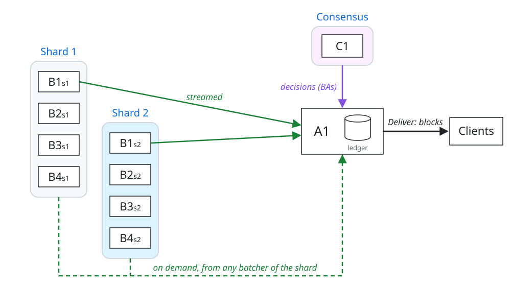
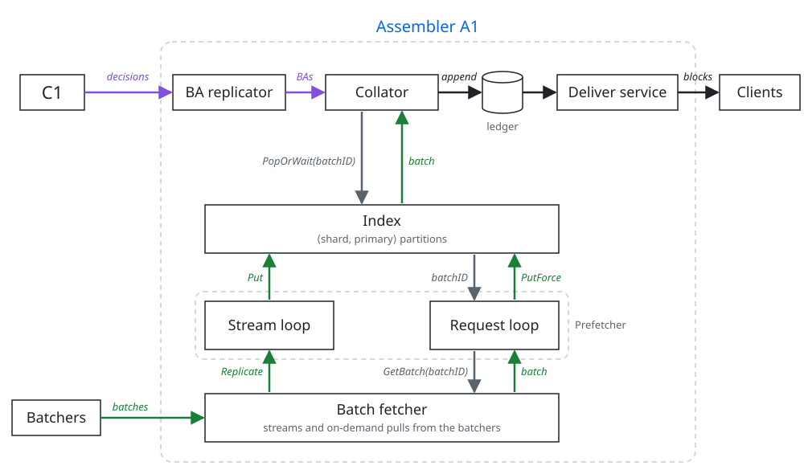
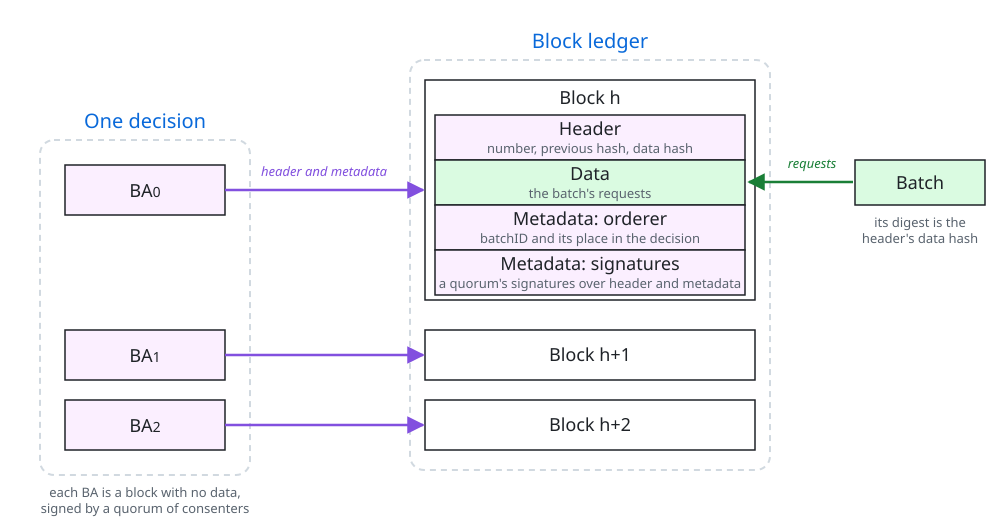

<!--
Copyright IBM Corp. All Rights Reserved.

SPDX-License-Identifier: Apache-2.0
-->
# Assembler

*Audience: block consumers and committer operators, ordering-service operators, and contributors
to the assembler implementation.*

This document describes the **assembler**, the Fabric-X Orderer node that produces the
Fabric-compatible block ledger and serves it to block consumers. It covers the interface a
consumer uses to read blocks, the internal design and algorithms a contributor needs to work on
the component, and the configuration, recovery, and failure behavior an operator needs to run it.
It focuses on the assembler; for the end-to-end system flow and how the assembler relates to the
other three roles, start with the
[architecture overview](architecture.md).

1. [Overview](#1-overview)
    1. [Units and Terms](#11-units-and-terms)
2. [Consuming Blocks: the Client Interface](#2-consuming-blocks-the-client-interface)
3. [Design and Internal Architecture](#3-design-and-internal-architecture)
    1. [Units and Wiring](#31-units-and-wiring)
    2. [Collation](#32-collation)
    3. [Prefetching](#33-prefetching)
    4. [Pairing batchIDs with Batches in the Index](#34-pairing-batchids-with-batches-in-the-index)
    5. [On-Demand Fetching](#35-on-demand-fetching)
    6. [Building the Block](#36-building-the-block)
    7. [Code Map](#37-code-map)
4. [Configuration](#4-configuration)
5. [Metrics and Monitoring](#5-metrics-and-monitoring)
6. [Failure and Recovery](#6-failure-and-recovery)
    1. [Restarting from the Ledger](#61-restarting-from-the-ledger)
    2. [Catching Up from Other Assemblers](#62-catching-up-from-other-assemblers)
    3. [When Other Nodes Fail](#63-when-other-nodes-fail)
7. [Reconfiguration](#7-reconfiguration)
8. [Deployment Guidance](#8-deployment-guidance)
9. [Further Reading](#9-further-reading)

## 1. Overview

The **assembler** ([`node/assembler`](../node/assembler))
is the party-local node that materializes the final, Fabric-compatible **block ledger**, and the
last stage of the Arma pipeline (**Router → Batcher → Consenter → Assembler**). Consensus orders
**batch attestations (BAs)** — in effect empty blocks, carrying a header and metadata that
reference a **batch** by its digest but no transactions — so the assembler is where the two halves
of the protocol rejoin: it takes the ordered BAs one at a time, fills each block with the
transactions of the batch it references, obtained from the batchers of the shard, appends the block
to its ledger, and serves it to block consumers. Doing this without stalling the ordered stream is
the assembler's central design problem, since obtaining a batch only once its BA has arrived would
cost a network round trip per block, and most of this document is about how that cost is avoided.

<picture>
  <source media="(prefers-color-scheme: dark)" srcset="figures/assembler-context-dark.svg">
  
</picture>

*Figure 1: The assembler's two input streams and its output — decisions from the consensus cluster,
full batches from the batchers of each shard, and the block ledger served to clients. The nodes shown
are part of a network of 4 parties and 2 shards; A1, C1 and B1 belong to party 1.*

### 1.1 Units and Terms

Three units do the assembler's central work, on the data and state named below; the units around them
are named in [Units and Wiring](#31-units-and-wiring). The terms the assembler is defined in are
system-wide: the data items among them — batch, BAF and BA — are defined in the
[data model](architecture.md#5-data-model) of the architecture overview, and party, shard, primary and
decision in the overview itself.

**Units**

- **Collator** — the unit that drives the order. It takes the BAs of each decision one at a time,
  obtains the full batch the BA refers to, sets its requests as the block data, and appends the
  block to the ledger.
- **Prefetcher** — the unit that obtains full batches from the batchers ahead of the collator and
  puts them in the index.
- **Index** — the in-memory store of batches waiting for their BA, inserted and retrieved by
  batchID. Prefetched batches are held under a memory budget and evicted when it is reached; batches
  fetched on demand are held until the collator takes them.

**Terms**

- **Prefetching** and **on-demand fetching** — the two ways a batch is obtained: streamed
  continuously from the batcher of the assembler's own party in each shard, or requested explicitly,
  by batchID, from all the batchers of a shard.
- **Partition** — a ⟨shard, primary⟩ pair. The index is split into one partition per pair, so each
  partition holds the batches of a single primary of a single shard, whose sequence numbers are
  consecutive.
- **Block ledger** — the assembler's durable output: the blocks it has committed, on local storage.
  Its **height** is the number of blocks committed so far, and the next block appended takes that
  number.
- **Ordering information** — what the assembler records with each block so it can resume after a
  restart: the decision number, the batch index within that decision, and the decision's batch
  count.
- **Batch frontier** — the last batch sequence the assembler has committed, per ⟨shard, primary⟩.
  It is where the batch streams resume after a restart.

## 2. Consuming Blocks: the Client Interface

The assembler serves blocks through Fabric's Atomic Broadcast `Deliver` service.

```protobuf
service AtomicBroadcast {
  // deliver first requires an Envelope of type DELIVER_SEEK_INFO with Payload data as a
  // marshaled SeekInfo message, then a stream of block replies is received.
  rpc Deliver(stream common.Envelope) returns (stream DeliverResponse);
}
```

A client opens a `Deliver` stream and sends a signed envelope of type `DELIVER_SEEK_INFO` that names
the assembler's channel and carries a `SeekInfo`:

```protobuf
message SeekInfo {
  enum SeekBehavior      { BLOCK_UNTIL_READY = 0; FAIL_IF_NOT_READY = 1; }
  enum SeekErrorResponse { STRICT = 0; BEST_EFFORT = 1; }
  enum SeekContentType   { BLOCK = 0; HEADER_WITH_SIG = 1; }

  SeekPosition      start          = 1;  // oldest | newest | specified number
  SeekPosition      stop           = 2;
  SeekBehavior      behavior       = 3;
  SeekErrorResponse error_response = 4;
  SeekContentType   content_type   = 5;
}
```

Both definitions are Fabric's own, from
[`orderer/ab.proto`](https://github.com/hyperledger/fabric-protos/blob/main/orderer/ab.proto), and
are shown here without their comments.

The start and stop positions are each the oldest block, the newest block, or a specified block
number. `Behavior` decides what happens at the tip of the ledger: `BLOCK_UNTIL_READY` waits for the
requested block to be committed, which is how a client follows the ledger as it grows, while
`FAIL_IF_NOT_READY` returns `NOT_FOUND` instead. `ContentType` decides how much of each block is
sent: `BLOCK` sends the whole block, while `HEADER_WITH_SIG` sends only the header and the metadata,
with the block data stripped — enough to check a block's signatures and its place in the chain
without transferring its payload. Config blocks are always sent whole. `ErrorResponse` decides
whether a consenter error is fatal to the request: `BEST_EFFORT` keeps delivering regardless, where
`STRICT` gives `SERVICE_UNAVAILABLE`.

To follow the ledger from a given block onward, a client stops at `MaxUint64`, which is never
reached. This is the same request the orderer's own nodes use to pull from one another:

```go
seekInfo := &orderer.SeekInfo{
    Start:         &orderer.SeekPosition{Type: &orderer.SeekPosition_Specified{Specified: &orderer.SeekSpecified{Number: startBlock}}},
    Stop:          &orderer.SeekPosition{Type: &orderer.SeekPosition_Specified{Specified: &orderer.SeekSpecified{Number: math.MaxUint64}}},
    Behavior:      orderer.SeekInfo_BLOCK_UNTIL_READY,
    ErrorResponse: orderer.SeekInfo_BEST_EFFORT,
}
```

The assembler streams the requested range and then a status response. After a successful range the
stream stays open for the client's next `SeekInfo`; any other status ends it.

Access is governed by the channel's `Readers` policy, evaluated over the signed envelope when the
request arrives; a request that fails it is answered with `FORBIDDEN`. When mutual TLS is enabled the
envelope must also carry the hash of the client's own TLS certificate, binding the request to the
connection it arrived on, and a stream whose client certificate has expired is terminated.
`BAD_REQUEST` answers a malformed envelope, a `SeekInfo` whose start or stop is missing or whose start
is beyond its stop, a timestamp more than an hour away from the assembler's clock, and a missing or
wrong certificate hash; a request for an unknown channel is answered with `NOT_FOUND`.

## 3. Design and Internal Architecture

The whole assembler is the two loops below: the prefetcher populating the index (I) with batches as
they arrive, and the collator consuming ordered BAs, taking each batch from the index or fetching it
on demand, and appending the completed block to the ledger (L).

```
1  do in parallel
      // Prefetcher: pull batches from batchers and index them
2     foreach incoming batch σ from batchers do
3        I.Put(σ);
4     end
      // Collator: consume ordered batch attestation, retrieve or fetch
      // batches on demand, and append completed blocks
5     foreach incoming batch attestation ba from consenter do
6        if I.Exists(ba.batchID) then
7           σ ← I.Pop(ba.batchID);
8        else
9           σ ← FetchBatch(ba.batchID);
10       end
11       L.Append(⟨ba, σ⟩);
12    end
13 end
```

Lines 6 to 10 are a single operation in the implementation: the collator asks the index for the
batch, and the index either yields it or waits for it and requests it on demand. Where the two loops
meet — the index — is also where the assembler's flow control lives, and the subsections below work
outwards from there.

### 3.1 Units and Wiring

Besides the collator, the prefetcher and the index, an assembler runs a **BA replicator**, which
pulls decisions from the consenter of its own party, extracts each BA together with its ordering
information, and hands them to the collator; a **batch fetcher**, which is what actually talks to
the batchers; and the `Deliver` service, which reads the ledger for clients. Decisions reach the
collator, and each shard's batches reach the prefetcher, through channels; the index is called
directly. The BA replicator pulls decisions in one goroutine and the collator runs in another. The
batch fetcher pulls each ⟨shard, primary⟩ stream in its own goroutine, and the prefetcher consumes
each shard's stream in one more. A single goroutine consumes the index's request channel and starts
one per on-demand fetch, which asks every batcher of the shard in parallel. The ledger is written by
the collator alone.

<picture>
  <source media="(prefers-color-scheme: dark)" srcset="figures/assembler-units-dark.svg">
  
</picture>

*Figure 2: The assembler's units, and how decisions, batches and blocks move between them.*

### 3.2 Collation

The collator consumes the BAs of each decision strictly in order, and does one of two things with
each. If the BA carries a config block, which is indicated by a shard of `ShardIDConsensus`
(`MaxUint16`) instead of a real shard, the block is appended to the ledger as it stands; and if the
configuration it carries is newer than the one the assembler is running, the assembler applies it
(see [Reconfiguration](#7-reconfiguration)) and the collator stops. Any other BA names a batch, so
the collator asks the index for it, and appends the resulting block once the index yields it.

Because collation is sequential and follows the consensus output alone, the ledger an assembler
produces does not depend on when its own fetches completed.

### 3.3 Prefetching

Prefetching rests on two properties of the batchers: a primary creates batches with consecutive
sequence numbers, and a batch is replicated among the batchers of its shard. The prefetcher
therefore asks the batcher of its own party in each shard for a stream of the batches of every
potential primary — one stream per party, of which one is active in steady state, carrying the
batches of the shard's current primary. Each stream starts at the batch frontier, so a restarted
assembler does not receive batches it has already committed, and every batch that arrives is put
into the index.

### 3.4 Pairing batchIDs with Batches in the Index

The index exists to pair two independent producers: batches arriving from the streams, and batchIDs
demanded by the collator as it walks the ordered stream. Each partition does that with three
operations and two caches. The collator calls `PopOrWait` with a batchID. A stream calls `Put` with
each batch it receives, and that batch goes into the cache bounded by the partition's memory budget,
ordered by sequence in a heap so that the lowest can be evicted. An on-demand fetch calls `PutForce`,
and that batch goes into a second cache, which the budget, the heap and the time-to-live do not apply
to, and which is therefore unbounded. `PopOrWait` looks in both. When the index wants a batch fetched
it puts its batchID on a request channel that the prefetcher consumes. Within a partition the streamed
batches arrive with increasing sequence numbers, which the index relies on rather than enforces, and
three sequence numbers drive its decisions: the highest sequence `PopOrWait` has been called with, the
last sequence a `Put` started, and the last sequence a `Put` completed.

`PopOrWait` either succeeds immediately or waits. If the batch is in either cache it is removed and
returned. If it is not, the index decides whether waiting can possibly help: when the demanded
sequence is below the sequence the streams have already reached, or is one the streams have already
delivered under a different digest, the batch will never arrive on a stream and is requested on demand
at once. Otherwise the collator waits for it to be streamed in, and a timer requests it on demand
anyway after `PopWaitMonitorTimeout`. This is the case where the primary failed, or is censoring the
batcher in the assembler's party.

`Put` is where the prefetcher is held back. A batch that is larger than the partition's whole budget,
or that the partition already holds, is rejected; otherwise, for as long as there is no room for it,
the index compares its sequence with the highest sequence `PopOrWait` has been called with. A batch
the collator has not reached yet means the prefetcher is running ahead, so the `Put` waits for the
collator to free space and then looks again. A batch the collator has already reached is needed now,
so batches are evicted — lowest sequence first, and only ones that a `Put` inserted — until the new
one fits. Every batch a `Put` inserts also carries a time-to-live and is dropped when it expires,
which is how batches whose BA never arrives, those of a primary that was replaced for instance, leave
the index. `PutForce` behaves differently on all three counts: it never waits, never evicts, and gives
the batch no time-to-live, because the collator is already waiting for exactly that batch. It too
rejects a batch larger than the budget, or one it already holds.

### 3.5 On-Demand Fetching

An on-demand request names one batchID, and the batch fetcher asks every batcher of that shard for
it in parallel, taking the first answer that matches and cancelling the rest. It asks all of them
because a BA only guarantees that the batch is held by at least one correct batcher in the shard,
which need not be the batcher of the assembler's own party. An answer is accepted only if the data
hash of the block that carried it is the hash of its data, and if its batchID is the one that was
requested; otherwise that batcher's answer is discarded and another batcher's is used.

### 3.6 Building the Block

The assembler does not compose a block header. Consensus orders, and signs, a block that already
carries its header and metadata and whose data field is empty; that block reaches the assembler as
part of the BA's ordering information, together with the consenters' signatures over it. Each
signature covers the block's header and its orderer metadata, so it covers the data too, through the
data hash in the header. The assembler sets the requests of the batch as the block data, writes the
signatures into the block's signature metadata, and appends. What binds the two halves together is
the digest: the data hash in the header consensus ordered is the digest of the batch the assembler
put in.

One decision therefore becomes as many blocks as it carries BAs, appended in the decision's own
order, and each block records which batch it came from and where in the ordered stream it sat.

<picture>
  <source media="(prefers-color-scheme: dark)" srcset="figures/assembler-block-dark.svg">
  
</picture>

*Figure 3: One decision becoming blocks — where the header, the data and each metadata field come
from.*

### 3.7 Code Map

| Concept | Source |
|---------|--------|
| Node lifecycle: start, stop, soft stop, applying a new config | [`assembler.go`](../node/assembler/assembler.go) |
| Collation | [`collator.go`](../node/assembler/collator.go) |
| Prefetcher: per-shard streams and the on-demand request loop | [`prefetcher.go`](../node/assembler/prefetcher.go) |
| Index, and pairing within a partition | [`prefetch_index.go`](../node/assembler/prefetch_index.go), [`partition_prefetch_index.go`](../node/assembler/partition_prefetch_index.go) |
| Caches, eviction heap, lookup by batchID | [`batch_cache.go`](../node/assembler/batch_cache.go), [`batch_heap.go`](../node/assembler/batch_heap.go), [`batch_mapper.go`](../node/assembler/batch_mapper.go) |
| Batch fetcher: streaming and on-demand pulls from batchers | [`batch_fetcher.go`](../node/assembler/batch_fetcher.go) |
| BA replicator | [`consensus_ba_deliver_client.go`](../node/delivery/consensus_ba_deliver_client.go) |
| `Deliver` service | [`assembler_deliver_service.go`](../node/assembler/assembler_deliver_service.go) |
| Block ledger, block metadata, batch frontier | [`node/ledger`](../node/ledger) |
| State synchronization | [`synchronizer/`](../node/assembler/synchronizer) |
| Metrics | [`metrics.go`](../node/assembler/metrics.go) |

## 4. Configuration

An assembler is configured like every other node: a local YAML file for what this node is and where
it keeps its state, and the shared configuration for what the network is, which it obtains from a
config block. The sections common to all roles — `General`, `FileStore`, `Operations` and `Metrics`
— are documented field by field in the commented
[`local_config.yaml`](../config/sample/local_config.yaml), and the
[configuration model](architecture.md#6-configuration-and-membership) of the architecture overview
explains how local and shared configuration fit together. Two of them decide how an assembler
starts: `General.Bootstrap` names the block it bootstraps from, which is the genesis block or, for a
node joining a running network, a later config block; and `FileStore.Location` is the directory its
block ledger is written to. The role-specific section is
`Assembler`, and this is the whole of it:

```yaml
# Assembler specific parameters
Assembler:
  PrefetchBufferMemoryBytes: 1073741824
  RestartLedgerScanTimeout: 5s
  PrefetchEvictionTtl: 1h
  PopWaitMonitorTimeout: 1s
  ReplicationChannelSize: 100
  BatchRequestsChannelSize: 1000
```

| Field | Default | What it controls |
|-------|---------|------------------|
| `PrefetchBufferMemoryBytes` | 1 GiB | The memory budget of **one partition** of the index. Raising it lets the prefetcher run further ahead of the collator; lowering it bounds memory, at the price of holding the streams back sooner. |
| `RestartLedgerScanTimeout` | 5s | How long the backwards scan of the ledger for the batch frontier may take at startup. If it expires before every ⟨shard, primary⟩ has been found, the streams of those not found resume from the beginning. |
| `PrefetchEvictionTtl` | 1h | How long a streamed batch may sit in the index before it is dropped. It bounds how long batches whose BA never arrives keep occupying space. |
| `PopWaitMonitorTimeout` | 1s | How long the collator waits for a batch to be streamed in before the index requests it on demand. Lowering it shortens the stall when a primary has failed or is censoring, at the price of fetches that the streams would have satisfied anyway. |
| `ReplicationChannelSize` | 100 | How many batches a shard's stream may buffer ahead of the index. |
| `BatchRequestsChannelSize` | 1000 | How many on-demand requests may sit queued for the prefetcher. It does not cap fetches in flight — each request is fetched in its own goroutine. |

The budget is worth a second look, because the field name understates it: it applies to each partition
separately, so an assembler's index can hold up to `PrefetchBufferMemoryBytes` × shards × parties at
once, plus whatever on-demand fetches have delivered.

From the shared configuration an assembler takes the topology it works against: every shard with all
of its batchers and their endpoints, so that it can stream batches from the batcher of its own party
and ask any batcher of a shard for one on demand; the consenter of its own party, which is where it
retrieves decisions; and the channel configuration carried in the config block, which gives it the
channel ID and the `Readers` policy its `Deliver` service enforces. None of this is in the local file,
and all of it except the set of shards can change through a new config block
(see [Reconfiguration](#7-reconfiguration)).

Templates can be found under
[`config/sample`](../config/sample):
[`local_config_assembler.yaml`](../config/sample/local_config_assembler.yaml)
for this role, and
[`shared_config.yaml`](../config/sample/shared_config.yaml)
for the network-wide part.

## 5. Metrics and Monitoring

An assembler exposes its metrics in Prometheus format on the operations endpoint configured by
`Operations.ListenAddress` and `Operations.ListenPort`, alongside a health check, a logging-spec
endpoint and version information. When `Metrics.MetricsLogInterval` is non-zero the node also writes a
periodic `ASSEMBLER_METRICS` line to its log, with the totals so far, the transactions and blocks
committed during the last interval, and the averages of the three latency histograms — enough to see
how a node is doing without a Prometheus deployment.

Five metrics are the assembler's own, each labelled with the party ID:

| Metric | What it tells you |
|--------|-------------------|
| `assembler_attestation_to_batch_collation_latency_seconds` | How long the collator waits between receiving a BA and having its batch in hand. Near zero means the batch was already in the index when the BA arrived, which is the steady state. Rising values mean collation is waiting for payloads. |
| `assembler_batch_unary_fetch_latency_seconds` | How long an on-demand fetch of a specific batch takes. It is only observed when the streams failed to supply a batch, so its rate matters as much as its value. |
| `assembler_batch_ledger_append_latency_seconds` | How long appending a block to the ledger takes. It follows the storage, not the network. |
| `assembler_prefetch_index_size_bytes` | How many bytes the index holds for a shard, summed over its partitions and including batches fetched on demand. With one active primary it tracks that partition's budget; after a primary change it can exceed the budget until the previous primary's batches expire. |
| `assembler_prefetch_index_cache_evictions_total` | How often a batch had to be evicted to make room for one the collator needs. |

Beside these, the ledger reports what has been committed —
`assembler_ledger_transaction_count_total`, `assembler_ledger_blocks_count_total` and
`assembler_ledger_blocks_size_bytes_total` — and the `Deliver` service reports the standard
`deliver_streams_opened`, `deliver_streams_closed`, `deliver_requests_received`,
`deliver_requests_completed` and `deliver_blocks_sent`.

Besides its metrics, a node keeps a status of its own, which moves between five states:
`initializing` while it starts up or takes a new configuration, `running` once it is serving,
`soft-stopped` while it is between configurations, `pending-admin` when a configuration change needs
an administrator, and `stopped`. The status is not published on the operations endpoint, so the node's
log is where these transitions are visible.

The full list of metrics for every role, and how to collect and visualize them, is in the
[monitoring and metrics guide](monitoring/metrics.md).

## 6. Failure and Recovery

### 6.1 Restarting from the Ledger

The assembler's ledger is its only durable state, and everything it needs
in order to resume is recorded in the blocks it has already committed.

Two streams have to be resumed, and each has its own starting point. The decision stream resumes from
the ordering information in the last block: if that block was the last BA of its decision the
assembler asks the consenter for the next decision, and otherwise for the same decision again, in
which case the BAs it has already committed are recognised by their batch index and skipped. A
decision that was interrupted halfway is therefore completed rather than repeated, and a batch is
never committed twice. The batch streams resume from the batch frontier, which the assembler
reconstructs by scanning its ledger backwards — skipping config blocks, and keeping the first
sequence it meets for each ⟨shard, primary⟩ — until it has found them all or
`RestartLedgerScanTimeout` expires. Each stream then asks for the batches after the sequence found for
its own ⟨shard, primary⟩, so a restarted assembler does not pull batches it has already committed.

### 6.2 Catching Up from Other Assemblers

An assembler that is new, or whose ledger is behind the config block it was given, cannot serve from
its own ledger and has to be filled from the assemblers of the other parties before it starts. It
does so in up to two phases, and the target is the height at which the config block it holds sits.

If its ledger is empty it first obtains the genesis block, asking every assembler endpoint and
accepting the block that at least *f*+1 of them agree on, which is what makes a fresh node's first
block safe to accept from parties it does not trust. From there, blocks are streamed from the other
assemblers into a buffer and committed one after another up to the target height. Each block is
verified before it is written — against the last config block the node holds, and against the block
before it — so a party that serves a wrong block cannot advance a synchronizing node's ledger. Once
the target height is reached the assembler starts normally, and 6.1 applies from that point on.

### 6.3 When Other Nodes Fail

The failure the design is built around is a shard primary that stops producing for this assembler,
either because it failed or because it is censoring the batcher this assembler streams from. The BA
still arrives from consensus, the batch does not arrive on the stream, and after
`PopWaitMonitorTimeout` the index requests it from every batcher of the shard, which is enough because
a BA guarantees at least one correct batcher in the shard holds the batch. The same request is made
immediately, without waiting, when consensus orders a batch that the streams have already gone past,
or one with the same ⟨shard, primary, sequence⟩ as a batch already streamed in but a different digest.

Two other failures are worth naming because their symptoms differ. If the batcher of the assembler's
own party is unreachable, that shard's streams stop, and every batch of that shard then arrives
through an on-demand fetch instead: the ledger still advances, at a cost in latency and in load on the
other parties' batchers. If the consenter of the assembler's own party is unreachable, no decisions
arrive at all, and the ledger stops advancing — the assembler does not fail over to another party's
consenter.

## 7. Reconfiguration

A new configuration reaches the assembler the way everything else does, in the decision stream. Unlike
a BA, a config block in a decision carries its own data — the whole new configuration — so there is no
batch to fetch and nothing to pair: the collator appends the block to the ledger as it stands. If the
configuration it carries is newer than the one the node is running, the node then applies it.

Applying begins with a **soft stop**: the prefetcher and the collator stop, while the `Deliver` service
stays up, so clients go on reading the blocks already committed. The node also acknowledges the new
configuration sequence to its consenter as soon as it has read the block, before deciding whether it
can apply it.

Not every change can be applied by the node itself. If the new configuration evicts the assembler's
own party, or changes this node's endpoint, TLS certificate or signing certificate, the node enters the
**pending-admin** state and waits for an administrator instead of reconfiguring itself; its `Deliver`
service remains available throughout, and its ledger stays at the config block until the local
configuration is updated and the process restarted. Anything else it applies on its own: it builds its
new configuration, stops its network service — which ends every open `Deliver` stream, so clients must
reconnect once the node is serving again — recreates the index, the prefetcher, the batch fetcher, the
BA replicator, the collator and the `Deliver` service against the new topology, and starts serving
again — all without restarting the process. The index is rebuilt every time, with one partition per
⟨shard, primary⟩ pair of the new configuration, so a party that joins or leaves gains or loses its
partitions. Because the rebuild starts by reading the ledger, both streams resume exactly as they do
after a restart, so no decision and no batch is missed across a reconfiguration.

For the configuration model this rests on, see
[Configuration and Membership](architecture.md#6-configuration-and-membership).

## 8. Deployment Guidance

<!-- Section 8 placeholder -->
*To be written: what to provision an assembler with — storage, and how fast it grows; the memory the
index needs; and network and endpoint considerations.*

## 9. Further Reading

- [Architecture overview](architecture.md) — the four roles, the end-to-end flow, and the
  configuration model.
- [APIs](api.md) — the gRPC services of every role, and which role implements which.
- [Monitoring and metrics](monitoring/metrics.md) — the full list of metrics, and how to collect and
  visualize them.
- [Deployment](../deployment/README.md) — how the nodes of a network are laid out over machines.
- [`arma` CLI](cli/arma.md) — the node binary and its subcommands.
- [`node/assembler`](../node/assembler) — the source.
