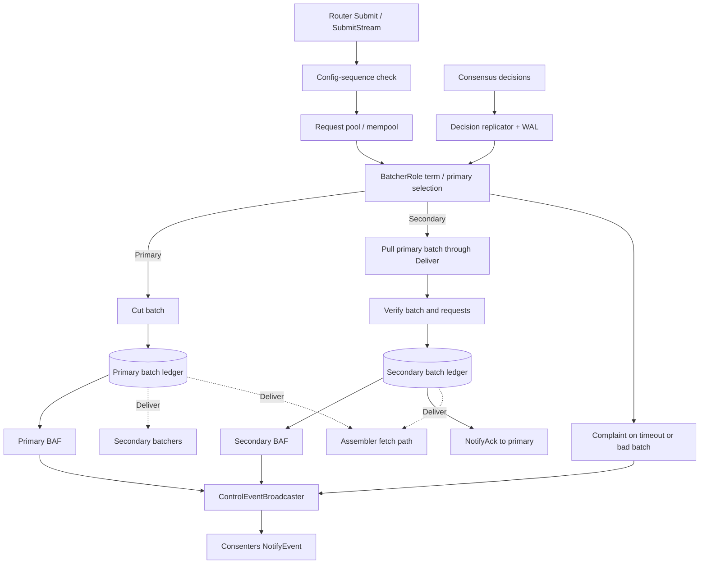

<!--
Copyright IBM Corp. All Rights Reserved.

SPDX-License-Identifier: Apache-2.0
-->
# Batcher Service

1. [Overview](#1-overview)
2. [Core Responsibilities](#2-core-responsibilities)
3. [Configuration](#3-configuration)
4. [Workflow Details](#4-workflow-details)
5. [APIs and Interfaces](#5-apis-and-interfaces)
6. [Metrics and Monitoring](#6-metrics-and-monitoring)
7. [Failure and Recovery](#7-failure-and-recovery)
8. [Implementation Details](#8-implementation-details)

## 1. Overview

Batchers are the shard-local transaction aggregation and storage nodes. Routers send requests to batchers according to shard mapping. The current primary batcher for a shard cuts requests into batches, persists batch payloads, and sends batch attestation fragments (BAFs) to consenters. Secondary batchers pull those primary batches, verify them, persist local copies, acknowledge the primary, and send their own BAFs.

Batchers are where Arma gains much of its horizontal scalability. Adding shards distributes request-pool work, primary batch creation, secondary batch pulling, disk I/O, and batch serving across more machines.

Read the chart as two loops joined by the batcher role. Router submissions enter through the config-sequence check and request pool. Consensus decisions enter through the decision replicator and determine term, primary selection, and whether this node acts as primary or secondary for the shard. The role combines those two inputs before any batch is attested.

When this batcher is primary, the flow goes left-to-right through batch cutting, primary-ledger append, and primary BAF broadcast. The payload is written before the BAF leaves the process, so any later ordered attestation points to data that should already be durable and available to serve. Primary ledger data is also exposed through `Deliver` so secondary batchers and assemblers can retrieve it.

When this batcher is secondary, the flow starts by pulling the primary's batch through `Deliver`. Verification is intentionally before ledger append and before secondary BAF emission: the secondary attests only after checking sequence, shard, digest, size, and request rules. After local persistence, the secondary both broadcasts its own BAF and acknowledges the primary so primary progress remains bounded by secondary progress.

Complaints are the control path for stalled or invalid primary behavior. Timeouts, bad batches, or verification failures can create complaint events, which use the same control-event broadcaster as BAFs. Consenters order those events and update Arma state, which then feeds back into batcher role selection through replicated decisions.

## 2. Core Responsibilities

The batcher role performs the middle stage between routing and consensus.

1. **Receive routed requests:** Accept unary or streaming submissions from routers for the batcher's shard.
2. **Check request admissibility:** Check router submissions against the active config sequence, and fully verify forwarded or batched requests when the batcher receives them from peer batchers or validates pulled batches.
3. **Manage request pool:** Buffer accepted requests until the primary can cut them into batches or secondaries can remove them after a verified batch.
4. **Create and persist batches:** As primary, build ordered batches and store payloads in the local batch ledger before sending a BAF.
5. **Pull, verify, and attest batches:** As secondary, pull primary batches, verify shard, sequence, digest, size, and request rules, then store the batch and send a BAF.
6. **Send BAFs and complaints:** Broadcast BAFs and complaints to consenters through the consensus `NotifyEvent` stream.
7. **Serve batch data:** Provide stored batches to secondary batchers and assemblers through the batcher deliver path.
8. **Track primary and acknowledgments:** Coordinate primary/secondary batcher behavior, batch sequence progress, acknowledgments, and term changes.

The batcher receives router traffic through the request transmit service and places accepted requests into the pool. A primary batcher cuts pool entries into ordered batches, persists payloads, and broadcasts BAF metadata to consenters. A secondary batcher pulls primary batches through `Deliver`, verifies the batch content, persists it, sends its BAF, and acknowledges the primary. Stored payloads remain available for assemblers after consensus orders their attestations.

The important split is payload durability versus metadata ordering. Batchers own payload durability and serving. Consenters only need the compact attestation metadata. This lets batcher shards absorb high-volume transaction data while the BFT cluster orders smaller control events.

## 3. Configuration

Batcher-local configuration comes from `config.NodeLocalConfig`.

Common settings define how the batcher process exposes services, loads local identity, stores durable state, and applies request verification rules. These values are shared with other node types, but their effect is batcher-specific because the batcher must accept router streams, serve stored batches, and maintain local ledgers for its shard.

- `General.ListenAddress` and `General.ListenPort`: batcher gRPC bind address.
- `General.TLS`: server TLS and optional client authentication.
- `General.ClientSignatureVerificationRequired`: enables request signature checks for router and batcher paths.
- `General.Bootstrap`: genesis/config block source.
- `General.LocalMSPDir` and `General.LocalMSPID`: local signing identity.
- `Metrics.MetricsLogInterval`: periodic metrics logging; `0` disables.
- `FileStore.Location`: local directory for batch ledgers, config store, and WAL.

Batcher-specific local settings bind one process to one shard and control how much backlog it can tolerate. They also limit how far a primary can progress ahead of secondaries, which protects the system from unbounded primary-side batch creation when peers are slow or unavailable.

- `Batcher.ShardID`: shard served by this batcher.
- `Batcher.BatchSequenceGap`: maximum sequence distance allowed between primary and secondary progress.
- `Batcher.MemPoolMaxSize`: maximum number of requests allowed in the request pool.
- `Batcher.SubmitTimeout`: maximum time a request may wait for request-pool submission.

Shared batching settings come from the genesis/config block, so every node interprets batch limits and timeout behavior consistently. The batcher extracts these values into `node/config.BatcherNodeConfig` at startup and during supported dynamic reconfiguration.

- `BatchingConfig.BatchSize.MaxMessageCount`: maximum number of requests in a batch.
- `BatchingConfig.BatchSize.AbsoluteMaxBytes`: maximum total bytes in a batch.
- `BatchingConfig.RequestMaxBytes`: maximum size of one request.
- `BatchingConfig.BatchTimeouts.BatchCreationTimeout`: maximum wait for primary batch creation.
- `BatchingConfig.BatchTimeouts.FirstStrikeThreshold`: request-pool first resend threshold.
- `BatchingConfig.BatchTimeouts.SecondStrikeThreshold`: complaint threshold after the first strike.
- `BatchingConfig.BatchTimeouts.AutoRemoveTimeout`: time after second strike before pool auto-removal.

`Batcher.ShardID` binds the process to one shard. Pool size and submit timeout define how much pressure the batcher can absorb before rejecting or delaying requests. Batch size, byte limits, and timeout settings bound how large and how old in-flight batches may become. Sequence-gap settings keep primary progress bounded relative to secondary acknowledgment progress.

## 4. Workflow Details

### Step 1. Startup

`CreateBatcher` opens the config store, initializes a SmartBFT WAL under `FileStore.Location/wal`, derives the last known decision number from WAL or config store, and calls `configureBatcher`. Configuration builds the batch ledger array, deliver service, batch puller, decision replicator, request inspector/verifier, metrics, consenter control-event senders, primary request connector, primary acknowledgment connector, and `BatcherRole`.

`StartBatcherService` creates the gRPC server and registers request transmit, batcher control, and Atomic Broadcast services. `Run` starts decision replication, starts the batcher role, and starts metrics. This lets the batcher react to consensus output, send BAFs and complaints to consenters, and exchange requests or acknowledgments with peer batchers.

### Step 2. Request ingestion

Routers send shard-routed requests to the batcher through `Submit` or `SubmitStream`. The batcher wraps request payload and signature as a Fabric envelope, checks that the request config sequence matches the batcher's current config sequence, and submits the envelope bytes into the request pool.

Full structure, shard, size, and signature-rule verification is performed for forwarded peer requests, batch verification, and mempool pruning during reconfiguration. If the pool is full or submission exceeds `SubmitTimeout`, pool submission returns an error that is reported on traced router requests.

### Step 3. Batch creation

`BatcherRole` owns the core batching loop. It watches decision-derived state to determine the current term and primary for the shard. If this batcher is primary, it waits for enough secondary acknowledgments, drains requests from the pool, cuts batches, assigns batch sequence numbers, appends the batch to the ledger, sends a BAF, records metrics, and removes batched requests from the pool.

If this batcher is secondary, it pulls batches from the current primary's deliver service, verifies primary ID, shard ID, sequence, digest, non-empty content, and request rules, appends the batch to its local ledger, sends a BAF, removes those requests from the pool, and sends an acknowledgment to the primary. Persisting payloads before BAF transmission ensures later fetches can retrieve batches referenced by ordered attestations.

### Step 4. BAF and control-event flow

After a primary creates a batch, or after a secondary verifies and persists a pulled batch, the batcher creates a signed BAF and broadcasts it to consenters as a `state.ControlEvent` over the consensus `NotifyEvent` stream. The same control-event path carries complaints when secondary verification fails or second-strike timeouts fire.

Primary request and acknowledgment connectors coordinate peer-batcher flow. `FwdRequestStream` forwards requests to the primary after first-strike timeouts, and `NotifyAck` sends secondary acknowledgments so the primary does not run too far ahead of secondaries.

### Step 5. Serving batches to assemblers

Assemblers fetch batches referenced by ordered attestations. Secondary batchers also use the same Atomic Broadcast `Deliver` path to pull batches from the current primary. The batcher deliver service serves the proper per-shard, per-party batch ledger based on the channel name.

### Step 6. Decision replication and reconfiguration

Batchers consume consensus decisions through the decision replicator. Each replicated header is appended to the local WAL, and config decisions update the config store. State updates drive term and primary changes, connector reconnection, pending BAF resubmission, and role changes.

Reconfiguration can update endpoints, certificates, shard membership, and batching parameters. Some changes require admin action or restart, such as party eviction, identity changes, or batching-parameter changes that cannot be applied while retaining the current mempool. When dynamic reconfiguration is supported, the batcher soft-stops the role, rebuilds components, prunes the mempool against the new config, restarts networking, and resumes processing.

## 5. APIs and Interfaces

Batchers expose internal orderer services rather than direct public client submission APIs. Each interface maps to one part of the batcher role: accepting shard-routed requests, coordinating with peer batchers, notifying consenters, or serving persisted payloads to downstream consumers.

- Request transmit service: receives unary or streaming routed requests from routers through `Submit` and `SubmitStream`.
- Batcher control service: exchanges peer-batcher forwarded requests and acknowledgments through `FwdRequestStream` and `NotifyAck`.
- Consenter event client: sends BAFs and complaints to consenters over the consensus `NotifyEvent` stream.
- Atomic Broadcast `Deliver`: serves persisted batch data from the batch ledger to secondary batchers and assemblers.
- Atomic Broadcast `Broadcast`: registered for interface compatibility but returns `not implemented`.

Routers use the request transmit service to feed the shard. Peer batchers use the batcher control service for forwarded requests and acknowledgments. Consenters receive BAF and complaint control events from batchers. Assemblers use the deliver path to fetch stored payloads after consensus orders their attestations.

External clients should submit to routers and receive final blocks from assemblers, not use batchers directly.

## 6. Metrics and Monitoring

Batcher metrics are defined in [`node/batcher/metrics.go`](https://github.com/hyperledger/fabric-x-orderer/blob/main/node/batcher/metrics.go). The monitoring endpoint uses `Operations.ListenAddress` and `Operations.ListenPort`; the metrics provider and logging interval come from `Metrics` settings.

Useful batcher metrics focus on role state, pool pressure, batch throughput, and corrective control paths. Reading them together is more useful than reading one counter alone: a growing mempool with flat batch creation points to primary progress trouble, while increased complaints or resends usually points to primary/secondary coordination or fetch failures.

- `batcher_current_role`: current role, where `1` is primary and `2` is secondary.
- `batcher_mempool_size`: current request-pool size.
- `batcher_role_changes_total`: number of primary/secondary role changes.
- `batcher_batches_created_total`: number of BAFs created (both as primary and secondary), initialized from the sum of on-disk ledger heights at startup.
- `batcher_batches_pulled_total`: number of batches pulled from other batchers or already present at startup.
- `batcher_batched_txs_total`: number of transactions included in batches.
- `batcher_router_txs_total`: number of transactions received from routers.
- `batcher_complaints_total`: number of complaints sent.
- `batcher_first_resends_total`: number of first-strike request resends.

These metrics reveal where batcher capacity is spent: router ingestion, pool growth, primary batch creation, secondary batch pulling, role churn, complaints, or first-strike resends. Batch serving latency is not currently exposed as a dedicated batcher metric.

## 7. Failure and Recovery

Batchers persist batch payloads, config-store state, and decision headers under `FileStore.Location`; the decision WAL lives under `FileStore.Location/wal`. On restart, a batcher reopens local stores, reads the WAL, falls back to the latest config block when needed, and starts decision replication from the last known decision number.

Connector failures toward consenters or peer batchers are handled by connector retry logic and gRPC behavior. Durable batch storage is the key recovery boundary: an ordered attestation remains useful only if assemblers can fetch the referenced batch payload.

`SoftStop` stops decision replication, control-event broadcasting, the batcher role, primary connectors, and metrics while preserving ledger and network resources for reconfiguration. Full `Stop` also closes WAL, network service, ledger, and the main exit channel.

## 8. Implementation Details

| Area | Source |
|------|--------|
| Batcher lifecycle and service registration | [`node/batcher/batcher.go`](https://github.com/hyperledger/fabric-x-orderer/blob/main/node/batcher/batcher.go) |
| Core batching role | [`node/batcher/batcher_role.go`](https://github.com/hyperledger/fabric-x-orderer/blob/main/node/batcher/batcher_role.go) |
| Batcher construction | [`node/batcher/batcher_builder.go`](https://github.com/hyperledger/fabric-x-orderer/blob/main/node/batcher/batcher_builder.go) |
| Batch delivery service | [`node/batcher/batcher_deliver_service.go`](https://github.com/hyperledger/fabric-x-orderer/blob/main/node/batcher/batcher_deliver_service.go) |
| Request inspection and verification | [`node/batcher/requests_inspector_verifier.go`](https://github.com/hyperledger/fabric-x-orderer/blob/main/node/batcher/requests_inspector_verifier.go) |
| Control event broadcaster | [`node/batcher/control_event_broadcaster.go`](https://github.com/hyperledger/fabric-x-orderer/blob/main/node/batcher/control_event_broadcaster.go) |
| Consenter control sender | [`node/batcher/consenter_control_event_sender.go`](https://github.com/hyperledger/fabric-x-orderer/blob/main/node/batcher/consenter_control_event_sender.go) |
| Primary request connector | [`node/batcher/primary_req_connector.go`](https://github.com/hyperledger/fabric-x-orderer/blob/main/node/batcher/primary_req_connector.go) |
| Primary acknowledgment connector | [`node/batcher/primary_ack_connector.go`](https://github.com/hyperledger/fabric-x-orderer/blob/main/node/batcher/primary_ack_connector.go) |
| Puller | [`node/batcher/puller.go`](https://github.com/hyperledger/fabric-x-orderer/blob/main/node/batcher/puller.go) |
| Acknowledgment tracking | [`node/batcher/acker.go`](https://github.com/hyperledger/fabric-x-orderer/blob/main/node/batcher/acker.go) |
| Client/TLS config | [`node/batcher/client_config.go`](https://github.com/hyperledger/fabric-x-orderer/blob/main/node/batcher/client_config.go) |
| Decision replicator creation | [`node/batcher/consensus_replicator_creator.go`](https://github.com/hyperledger/fabric-x-orderer/blob/main/node/batcher/consensus_replicator_creator.go) |
| Metrics | [`node/batcher/metrics.go`](https://github.com/hyperledger/fabric-x-orderer/blob/main/node/batcher/metrics.go) |
| Tests | [`node/batcher`](https://github.com/hyperledger/fabric-x-orderer/blob/main/node/batcher) |
