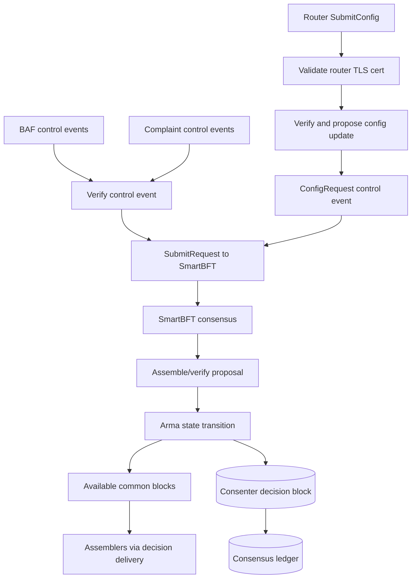

<!--
Copyright IBM Corp. All Rights Reserved.

SPDX-License-Identifier: Apache-2.0
-->
# Consenter Service

1. [Overview](#1-overview)
2. [Core Responsibilities](#2-core-responsibilities)
3. [Configuration](#3-configuration)
4. [Workflow Details](#4-workflow-details)
5. [APIs and Interfaces](#5-apis-and-interfaces)
6. [Metrics and Monitoring](#6-metrics-and-monitoring)
7. [Failure and Recovery](#7-failure-and-recovery)
8. [Implementation Details](#8-implementation-details)

## 1. Overview

Consenters run the SmartBFT ordering core of Fabric-X Orderer. They order Arma control events, not transaction payloads. Control events are:

- batch attestation fragments (BAFs) from batchers;
- complaints used to rotate shard primaries;
- configuration requests submitted by the local party's router.

Ordered SmartBFT decisions are stored in the consenter ledger. Each decision contains the SmartBFT proposal and signatures. The proposal header embeds Arma state and the Fabric-compatible common blocks that became available in that decision. Assemblers later consume those available common blocks/ordered batch attestations and fetch transaction payloads from batchers.

Read the chart from the three event sources into SmartBFT. BAFs and complaints arrive from batchers as already-signed Arma control events. Config requests arrive from the local router through `SubmitConfig`, which adds an extra router-certificate check before the config update is wrapped as a control event. All three paths converge at `SubmitRequest` and become inputs to SmartBFT.

The middle of the chart is the consensus boundary. Before ordering, each control event is verified against current configuration, signer identity, and event-specific rules. During proposal assembly and verification, the consenter simulates Arma state transitions so every correct consenter can independently derive the same resulting state, available common blocks, and decision metadata from the ordered request set.

The lower half shows what leaves consensus. A SmartBFT decision persists the ordered proposal and signatures in the consenter ledger. The proposal header carries Arma state and available common blocks. Assemblers consume those available blocks later, then fetch referenced payload batches from batchers. Thus consenters decide order and state transitions, but assemblers perform payload materialization.

Config flow uses same ordering machinery as data flow. A config update is not applied merely because router submitted it; it must be validated, ordered, written into a decision, and then processed by each role. This keeps membership and parameter changes aligned with BFT decision order.

## 2. Core Responsibilities

Consenters provide total order over metadata and drive configuration progress.

1. **Receive control events:** Accept BAFs, complaints, and config requests through consenter-facing APIs.
2. **Verify before ordering:** Verify BAF and complaint signatures, config sequence, config request structure, config policy/rules, and local-router identity for `SubmitConfig`.
3. **Run SmartBFT:** Submit valid control events to SmartBFT and exchange consensus messages with peer consenters.
4. **Maintain Arma state:** Track shard terms, pending BAFs, complaints, thresholds/quorums, and app context.
5. **Create available common blocks:** When enough BAFs exist, create data common blocks; when config requests exist, create config common blocks.
6. **Persist decision blocks:** Append SmartBFT decisions to the consensus ledger and keep SmartBFT WAL for recovery.
7. **Deduplicate completed attestations:** Index ordered batch digests in the batch attestation database (BADB) so already-ordered attestations are not proposed again.
8. **Handle reconfiguration:** Soft-stop, validate/apply compatible config changes dynamically, or move to pending-admin state when local admin restart/action is required.

Consenters do not store full transaction batches and do not accept client transaction broadcast directly. Routers handle client submission; assemblers serve final block delivery.

This makes consenter resource usage different from batcher resource usage. Consenters spend CPU and network on BFT message exchange, signatures, state simulation, and ledger decisions. They should not become data-plane storage nodes for full transaction batches; that pressure belongs to batchers and assemblers.

## 3. Configuration

Consenter-local configuration starts in `config.NodeLocalConfig` and is translated into `node/config.ConsenterNodeConfig`.

Common settings:

- `General.ListenAddress` and `General.ListenPort`: consenter gRPC bind address.
- `General.MonitoringListenAddress` and `General.MonitoringListenPort`: Prometheus/metrics endpoint; monitoring address defaults to listen address when empty.
- `General.TLS`: server TLS and client-auth material.
- `General.Cluster`: ordering-node TLS material used for consenter cluster communication.
- `General.Bootstrap`: bootstrap/config block source.
- `General.LocalMSPDir` and `General.LocalMSPID`: local signing identity.
- `General.MetricsLogInterval`: periodic metrics logging; `0` disables periodic log output.
- `FileStore.Path`: consensus ledger directory and BADB parent directory.

Consenter-specific setting:

- `Consensus.WALDir`: SmartBFT write-ahead-log directory. If empty after config translation, default is `<FileStore.Path>/wal`.

Runtime storage under `FileStore.Path` includes:

- consensus ledger (`ledger.NewConsensusLedger(nodeConfig.Directory)`);
- batch attestation DB at `<FileStore.Path>/batchDB`;
- default SmartBFT WAL at `<FileStore.Path>/wal` unless `Consensus.WALDir` overrides it.

Production deployments should use mTLS for all node-to-node paths and ensure every party starts from compatible bootstrap configuration.

## 4. Workflow Details

### Step 1. Construction and startup

`CreateConsensus` initializes node status, then `configureConsensus` builds the consensus ledger, initial Arma state, BADB, signature verifier, request verifiers, SmartBFT instance, communication layer, synchronizer, and metrics.

Startup has two calls:

1. `StartConsensusService` creates/registers the gRPC services and starts network serving.
2. `Start` marks node running, starts metrics, and starts SmartBFT.

Registered services include:

- `protos.Consensus` for internal control-event notification and config submission;
- Fabric `AtomicBroadcast` backed by consenter `DeliverService` for decision/block delivery;
- `ClusterNodeService` for consensus cluster communication.

### Step 2. Control-event validation

`SubmitRequest` verifies serialized `state.ControlEvent` bytes before forwarding them to SmartBFT:

- BAFs must match current config sequence and verify against batcher public key for their shard/party.
- Complaints must match current config sequence and verify against signer key for their shard/party.
- Config requests must pass config-request validation, new-config rules, and transition rules.

`SubmitConfig` is separate. It accepts a `protos.Request` from the router in the same party, validates the caller TLS certificate against configured router TLS cert, verifies/proposes the config update, wraps it as a config-request control event, and submits it to SmartBFT.

`NotifyEvent` receives a stream of raw event payloads and calls `SubmitRequest` for each event until EOF, error, or soft stop.

### Step 3. SmartBFT ordering and proposal handling

SmartBFT uses `Consensus` as its application, assembler, signer, verifier, and request inspector.

Important SmartBFT callbacks implemented by `Consensus`:

- `RequestID` and `VerifyRequest`: identify and validate control events.
- `AssembleProposal`: simulate Arma state transition for selected requests and build proposal header/payload.
- `VerifyProposal`: recompute state transition, available common blocks, tx count, config sequence, and header state.
- `SignProposal` and `VerifyConsenterSig`: sign/verify proposal and embedded available common block metadata.
- `Deliver`: persist decided proposal/signatures and update runtime state.

### Step 4. Arma state transition

`Consenter.SimulateStateTransition` converts request bytes to `state.ControlEvent` values, skips BAFs whose digest already exists in BADB, and calls `State.Process`.

`State.Process`:

- filters pending BAFs and complaints from old config sequences;
- collects and deduplicates BAFs/complaints;
- rotates shard primary term when complaint threshold is reached;
- removes stale complaints;
- extracts BAFs with threshold signatures from pending state;
- extracts config requests from input events.

The current rule list intentionally does not run equivocation detection or old-attestation cleanup; both are present in code but disabled.

### Step 5. Available common blocks and decision persistence

`AssembleProposal` converts extracted attestations into data common blocks. If one or more config requests exist, it creates one config common block from the first request. Proposal header contains:

- available common blocks;
- resulting Arma state;
- decision number;
- decision number of last config block;
- previous consenter decision hash.

`Deliver` runs after SmartBFT decides:

1. Deserialize proposal header and collect non-config block data hashes.
2. Index those data hashes in BADB before appending decision block.
3. Append consenter decision block to consensus ledger.
4. Update Arma state, previous decision hash, counters, and metrics.
5. If decision contains a newer config block, update config tracking and launch config processing.

BADB indexing happens before ledger append intentionally: indexing same digest twice is idempotent, and restart/synchronization can repair ledger-side state.

### Step 6. Reconfiguration

When a delivered decision contains a newer config block, `processNewConfigBlock` soft-stops consensus and calls `ApplyConfig`.

`ApplyConfig`:

- builds updated full configuration from config block;
- detects party eviction;
- checks whether local consenter identity/address/cert changes require admin restart;
- currently waits one minute before dynamic reconfiguration;
- if safe, closes old storage/network, rebuilds consensus from new config, restarts service and SmartBFT.

If party eviction or local identity change requires admin action, node moves to `StatePendingAdmin` and does not dynamically restart.

Synchronizer-applied config blocks update state and runtime config too, but currently soft-stop rather than fully dynamic-apply through `processNewConfigBlock`.

## 5. APIs and Interfaces

Consenters expose internal orderer APIs plus Fabric-compatible delivery for consenter decision blocks.

- `protos.Consensus.NotifyEvent`: stream control events into consensus.
- `protos.Consensus.SubmitConfig`: submit router-originated config requests.
- `orderer.ConsensusRequest` / `orderer.SubmitRequest`: SmartBFT cluster message/request handling through `OnConsensus` and `OnSubmit`.
- Fabric `AtomicBroadcast.Deliver`: serves consenter ledger blocks through `delivery.DeliverService`.
- `orderer.ClusterNodeService`: cluster node service registered on consensus server.

Clients should not submit application transactions to consenters. Client transaction `Broadcast` goes to routers; final block `Deliver` goes to assemblers.

## 6. Metrics and Monitoring

Consenter metrics are defined in [`node/consensus/metrics.go`](https://github.com/hyperledger/fabric-x-orderer/blob/main/node/consensus/metrics.go). The monitoring endpoint uses translated `MonitoringListenAddress`.

Counters:

- `consensus_decisions_count{party_id}`: decisions made / decision blocks present at startup plus delivered decisions.
- `consensus_blocks_count{party_id}`: available common blocks ordered by delivered decisions.
- `consensus_bafs_count{party_id}`: BAF control events accepted by `SubmitRequest`.
- `consensus_complaints_count{party_id}`: complaint control events accepted by `SubmitRequest`.
- `consensus_txs_count{party_id}`: ordered transaction count derived from available common block metadata.

If `MetricsLogInterval > 0`, logs periodically emit decision/block interval rates plus total BAF/complaint counts. On stop, logs emit final decision, block, BAF, complaint, and tx totals.

## 7. Failure and Recovery

Recovery uses three persistent sources:

- SmartBFT WAL from `Consensus.WALDir` or default `<FileStore.Path>/wal`;
- consensus ledger under `FileStore.Path`;
- BADB under `<FileStore.Path>/batchDB`.

On startup, the consenter reads ledger height. If ledger is empty and bootstrap block is genesis, it appends a genesis decision. If ledger has blocks, it reconstructs Arma state, SmartBFT metadata, last proposal/signatures, decision number of last config block, previous hash, and tx count from the last consenter decision block.

If a new consenter starts with empty ledger and last config block number greater than zero, `SyncOnStart` is enabled. The BFT synchronizer can pull missing consenter blocks, prune committed requests from SmartBFT mempool, and update state/runtime config from pulled blocks.

Shutdown behavior:

- `SoftStop` stops SmartBFT, synchronizer, BADB, and metrics, but leaves network/storage to support pending restart/admin flows.
- `Stop` stops SmartBFT, closes storage, stops network, and closes `MainExitChan`; if not already soft-stopped/pending-admin, it also stops synchronizer, BADB, and metrics.

## 8. Implementation Details

| Area | Source |
|------|--------|
| Consensus lifecycle, services, SmartBFT callbacks | [`node/consensus/consensus.go`](https://github.com/hyperledger/fabric-x-orderer/blob/main/node/consensus/consensus.go) |
| Consensus construction, initial state, WAL, communication, synchronizer | [`node/consensus/consensus_builder.go`](https://github.com/hyperledger/fabric-x-orderer/blob/main/node/consensus/consensus_builder.go) |
| Arma control-event simulation and BADB indexing | [`node/consensus/consenter.go`](https://github.com/hyperledger/fabric-x-orderer/blob/main/node/consensus/consenter.go) |
| SmartBFT support adapter for synchronizer | [`node/consensus/consenter_support_adapter.go`](https://github.com/hyperledger/fabric-x-orderer/blob/main/node/consensus/consenter_support_adapter.go) |
| Config application | [`node/consensus/consensus_config_applier.go`](https://github.com/hyperledger/fabric-x-orderer/blob/main/node/consensus/consensus_config_applier.go) |
| Control events and Arma state model | [`node/consensus/state`](https://github.com/hyperledger/fabric-x-orderer/blob/main/node/consensus/state) |
| Batch attestation database | [`node/consensus/badb`](https://github.com/hyperledger/fabric-x-orderer/blob/main/node/consensus/badb) |
| BFT synchronizer | [`node/consensus/synchronizer`](https://github.com/hyperledger/fabric-x-orderer/blob/main/node/consensus/synchronizer) |
| Metrics | [`node/consensus/metrics.go`](https://github.com/hyperledger/fabric-x-orderer/blob/main/node/consensus/metrics.go) |
| Tests | [`node/consensus`](https://github.com/hyperledger/fabric-x-orderer/blob/main/node/consensus) |
