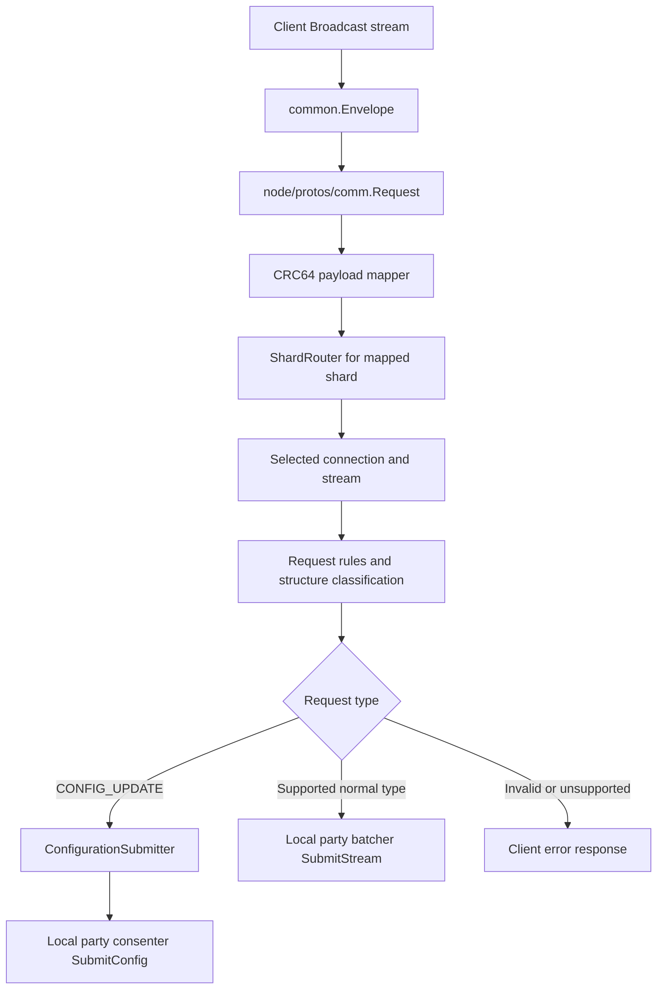

<!--
Copyright IBM Corp. All Rights Reserved.

SPDX-License-Identifier: Apache-2.0
-->
# Router Service

1. [Overview](#1-overview)
2. [Core Responsibilities](#2-core-responsibilities)
3. [Configuration](#3-configuration)
4. [Workflow Details](#4-workflow-details)
5. [APIs and Interfaces](#5-apis-and-interfaces)
6. [Metrics and Monitoring](#6-metrics-and-monitoring)
7. [Failure and Recovery](#7-failure-and-recovery)
8. [Implementation Details](#8-implementation-details)

## 1. Overview

Routers are client-facing ingress nodes for transaction submission. They register Fabric Atomic Broadcast `Broadcast` and internal Arma request transmit services, map each request payload to a batcher shard, classify and validate requests, and forward normal requests to batchers in the local party.

A router is not the final validator for transaction semantics. It protects the ordering path from malformed, oversized, unsupported, or unauthorized submissions according to configured request rules. Fabric-X committer later performs endorsement, namespace-policy, MVCC, and commit validation.

A client begins the flow by sending a Fabric `common.Envelope` on a `Broadcast` stream. The router translates that envelope into the internal Arma request format while preserving the payload, signature, and current configuration sequence. This translation gives the rest of the Arma orderer a single request shape regardless of whether the request entered through the public Fabric API or an internal transmit API.

After translation, the router computes a deterministic shard route from the request payload. It uses CRC64 over the payload, derives a request ID from that checksum, and maps the checksum to one configured shard. Because every router uses the same sorted shard list from the shared configuration, identical payloads are routed to the same shard across routers that run the same configuration.

The selected shard router then chooses a local-party batcher connection and submit stream. This step keeps routing separate from batch creation: routers decide where a request should go, while batchers own buffering, batching, and durable batch storage. If a chosen stream is unavailable, the router reports a server-side forwarding error for that request and triggers reconnection handling for affected streams.

Before any request leaves the stream worker, router-side rules classify and validate it. The worker checks for empty payloads, oversized payloads, malformed signatures, unsupported Fabric header types, and optional client signature or writers-policy failures. These checks are intentionally early so malformed or unauthorized traffic is rejected before it consumes batcher capacity.

Classification decides the next hop. Supported normal transaction types are forwarded to the local-party batcher `SubmitStream` for the mapped shard. `CONFIG_UPDATE` requests are diverted to `ConfigurationSubmitter`, which proposes and validates the configuration update before sending it to the local-party consenter through `SubmitConfig`. Unsupported or invalid request types do not continue through the ordering path and instead produce an error response.

The response visible to the caller depends on the entry point. Fabric `Broadcast` receives a fast acceptance or rejection response after router-side processing and send-to-batcher succeeds. Internal traced submits can wait for batcher or config-submitter feedback. Neither response means the transaction has reached final block delivery; it only describes router acceptance and forwarding progress.

## 2. Core Responsibilities

Router owns first stage of Arma orderer request flow:

1. **Accept submissions:** Receive client `common.Envelope` messages through Fabric `Broadcast` streams and internal `RequestTransmit` requests.
2. **Map by shard:** Use CRC64 over request payload to assign each request to a shard.
3. **Forward to local batchers:** Maintain one `ShardRouter` per configured shard and gRPC streams to local-party batchers.
4. **Validate and classify requests:** Apply payload, size, signature/policy, structure, and request-type checks before dispatch from stream workers.
5. **Handle configuration updates:** Route `CONFIG_UPDATE` requests through `ConfigurationSubmitter`, config update proposal, orderer rule validation, transition validation, and local consenter `SubmitConfig`.
6. **Track configuration progress:** Pull consensus decisions, persist last decision in router WAL, store config blocks, and apply dynamic reconfiguration when possible.
7. **Report request metrics:** Count received requests and rejected requests by broad error class.

Every request is mapped first. Normal requests continue through the selected shard router and selected batcher stream. Config update requests are detected during stream processing and sent to the config submitter instead of the batcher.

Shard placement is deterministic because routers sort configured shard IDs and use the same CRC64 payload mapping. Batcher shards can scale independently while all routers route compatible request payloads to the same shard index.

This ordering matters operationally. A router can accept traffic for all shards, but each request is pushed onto exactly one shard path after mapping. If a shard-local batcher stream is down, only traffic mapped to that shard is affected; other shard routers can keep using their own connection pools.

## 3. Configuration

Router-local configuration comes from `config.NodeLocalConfig` and is extracted into `node/config.RouterNodeConfig`.

Common settings:

- `General.ListenAddress` and `General.ListenPort`: router gRPC bind address.
- `Operations.ListenAddress` and `Operations.ListenPort`: Prometheus/metrics bind address. If operations address is empty, router uses `General.ListenAddress`.
- `General.TLS`: server TLS configuration and inbound client authentication setting.
- `General.ClientSignatureVerificationRequired`: enables request signature verification in router and batcher request rules.
- `General.Bootstrap`: genesis/config block source.
- `General.LocalMSPDir` and `General.LocalMSPID`: local signing identity.
- `Metrics.MetricsLogInterval`: periodic metrics logging interval; `0` disables periodic metric logs but not metrics endpoint creation.
- `FileStore.Location`: local directory for router config store and router WAL.

Router-specific settings:

- `Router.NumberOfConnectionsPerBatcher`: gRPC connections opened from each shard router to its local-party batcher.
- `Router.NumberOfStreamsPerConnection`: bidirectional submit streams opened on each connection.

If connection count is `0`, startup uses `config.DefaultRouterParams.NumberOfConnectionsPerBatcher` (`10`). If stream count is `0`, startup uses `config.DefaultRouterParams.NumberOfStreamsPerConnection` (`5`). Together, these values define router-to-batcher parallelism.

Extracted shared configuration supplies:

- sorted shard metadata and batcher endpoints;
- local-party consenter endpoint;
- request max bytes from batching configuration;
- channel bundle for policy and configtx validation;
- ordering-service, application, and local client trusted roots.

Outbound router-to-batcher and router-to-consenter connections use TLS with client certificates.

## 4. Workflow Details

### Step 1. Startup

`NewRouter` initializes components that survive reconfiguration:

1. Collect shard IDs from router node config.
2. Sort shard IDs.
3. Create CRC64 shard mapper using shard count.
4. Open config store under `FileStore.Location`.
5. Initialize router WAL under `FileStore.Location/wal`.
6. Calculate next decision number from WAL or last config block.
7. Call `initFromConfig`.

`initFromConfig` then:

1. Sets node status to initializing with current config sequence.
2. Applies default connection/stream counts if needed.
3. Builds request verifier.
4. Creates config submitter.
5. Selects batcher endpoints and TLS CAs for batchers in same party.
6. Creates one `ShardRouter` per configured shard.
7. Creates decision puller for local-party consenter decisions.
8. Creates and starts router metrics.
9. Initializes shard router connections and streams.

`StartRouterService` creates router gRPC server, registers `RequestTransmit` and Fabric Atomic Broadcast services, starts config submitter, starts decision pulling, and marks node running.

### Step 2. Request intake

`Broadcast` receives Fabric `common.Envelope` messages. For each envelope, router creates `node/protos/comm.Request` with envelope payload, signature, and current config sequence.

`SubmitStream` and unary `Submit` receive internal `RequestTransmit` requests. Router sets request config sequence before forwarding.

For every accepted request path, router increments received request counter, maps request payload, and forwards a tracked request to the selected shard router unless router is stopping.

### Step 3. Shard mapping

Router maps request payloads with CRC64 ECMA:

1. Compute `crc64.Checksum(payload)`.
2. Encode checksum as 8-byte big-endian request ID.
3. Compute shard index as `uint16(checksum) % shardCount`.
4. Convert shard index to actual shard ID using sorted shard ID list.

The request ID also chooses connection and stream within the selected shard router. `ShardRouter.Forward` uses first two bytes of request ID modulo connection count and stream count.

### Step 4. Shard routing and stream dispatch

Each `ShardRouter` owns:

- connection pool to one local-party batcher endpoint for its shard;
- configured number of streams per connection;
- reconnection goroutine;
- request verifier and config submitter reference.

If selected stream is missing or faulty, router returns server error to client and notifies reconnection logic when possible. If stream is usable, request enters stream request channel.

Stream worker verifies and classifies the request before dispatch:

1. Payload must be non-empty.
2. Payload size must not exceed configured request max bytes.
3. Signature filter validates structure, and when enabled, client signature/policy with channel writers policy.
4. Request structure is classified into Fabric header type.
5. Unsupported types are rejected: `CONFIG`, `ORDERER_TRANSACTION`, and `DELIVER_SEEK_INFO`.

If type is `CONFIG_UPDATE`, stream forwards request to `ConfigurationSubmitter`. Otherwise, stream sends request to batcher `SubmitStream`.

### Step 5. Response semantics

`Broadcast` requests are untraced inside router. For normal requests, router sends `BroadcastResponse{Status: SUCCESS}` after stream successfully sends request to batcher. This is a fast acceptance response, not proof of ordering, committing, endorsement validity, or MVCC validity. If verification, structure, connection, or stopping errors occur, router returns `BroadcastResponse{Status: INTERNAL_SERVER_ERROR, Info: error}`.

`SubmitStream` and unary `Submit` use trace IDs. For normal requests, router registers trace ID and waits for batcher `SubmitResponse`. For config updates, config submitter sends response after config proposal/rule validation and consenter `SubmitConfig` call. Submit responses can include request IDs, trace IDs, and error strings.

### Step 6. Configuration submissions

Config update requests go through `ConfigurationSubmitter`:

1. Propose config update with `ConfigUpdateProposer` using channel bundle, local signer, and verifier.
2. Validate new config with orderer rules.
3. Validate transition from current bundle to proposed config.
4. Connect to local-party consenter with TLS/mTLS.
5. Call consensus `SubmitConfig`.
6. Return success or error to waiting client response channel.

Config update requests are still initially mapped to a shard and pass through a shard router stream before classification sends them to config submitter.

### Step 7. Configuration progress and dynamic reconfiguration

Router pulls ordered decisions from consensus using a `DecisionPuller`. Current implementation pulls from local-party consenter endpoint.

For each pulled decision, router appends serialized decision header to router WAL, keeping only the last decision. If decision contains a newer config block, router stores that block in config store, starts config processing, and stops pulling additional decisions until restart/reconfiguration flow completes.

Processing a new config block:

1. Soft-stop router: stop new requests, stop decision puller, soft-stop shard routers, drain feedback channels, stop config submitter, stop network, stop metrics.
2. Build updated configuration from config block.
3. If party was evicted, mark admin action required.
4. If router identity/node config change requires restart, mark admin action required.
5. Otherwise extract new router config, reinitialize components, and restart router service dynamically.

## 5. APIs and Interfaces

Routers expose/implement these gRPC APIs:

- **Fabric Atomic Broadcast `Broadcast`:** public client envelope submission API.
- **Fabric Atomic Broadcast `Deliver`:** registered by service but router implementation returns `not implemented`; block delivery belongs to assemblers.
- **Arma `RequestTransmit.SubmitStream`:** internal streaming request API used by orderer components and tests.
- **Arma `RequestTransmit.Submit`:** internal unary request API.

Internal router interfaces/components:

- `ShardMapper`: maps payload bytes to shard index and request ID.
- `ShardRouter`: manages local-party batcher connections, streams, request queues, and reconnection.
- `stream`: verifies/classifies requests, sends normal requests to batcher, forwards config updates to config submitter, and propagates responses/errors.
- `ConfigurationSubmitter`: validates/proposes config updates and forwards them to consenter `SubmitConfig`.
- `DecisionPuller`: retrieves ordered consensus decisions for config progress.
- `RouterMetrics`: owns metrics provider, Prometheus monitor, counters, and periodic logs.

Clients that need ordered block delivery must connect to assemblers, not routers.

## 6. Metrics and Monitoring

Router metrics are defined in [`node/router/metrics.go`](https://github.com/hyperledger/fabric-x-orderer/blob/main/node/router/metrics.go). Monitoring endpoint uses `Operations.ListenAddress` and `Operations.ListenPort`; if address is empty, config extraction uses `General.ListenAddress`.

Actual router metrics:

- `router_requests_completed{party_id}`: increments when router receives a request on `Broadcast`, `SubmitStream`, or `Submit`.
- `router_requests_rejected{code="400",party_id}`: increments for request verification, request structure verification, or bad request errors.
- `router_requests_rejected{code="500",party_id}`: increments for server errors.

Periodic metric logs, when `Metrics.MetricsLogInterval > 0`, include:

- party ID;
- total transactions received;
- transactions received per second since previous report;
- rejected count with code 400;
- rejected count with code 500.

Router code does not currently export per-shard routing metrics, per-stream pressure metrics, per-connection pressure metrics, or per-Fabric-status response metrics. Use logs and batcher metrics alongside router counters when diagnosing stream, connection, or backpressure symptoms.

## 7. Failure and Recovery

Router persists configuration state and decision progress under `FileStore.Location`:

- config store stores config blocks;
- router WAL stores last pulled consensus decision header under `FileStore.Location/wal`.

On restart, router chooses next decision number as follows:

1. If WAL has entries, deserialize last decision header and pull that same decision again, in case router failed before storing config block from that decision.
2. If WAL is empty and last config block is genesis, start at decision `1`.
3. If WAL is empty and last config block is not genesis, extract decision number from last config block metadata and start at next decision.

Batcher stream failures mark streams faulty, send server errors to pending clients, and notify shard-router reconnection logic. Reconnection uses retry/backoff; when batcher reports stopped, stream notification applies exponential backoff up to maximum interval.

`Stop` stops networking, metrics, config submitter, decision pulling, shard routers, WAL, node status, and main exit channel. `SoftStop` is used during reconfiguration to stop accepting new work, notify pending requests, drain feedback, and stop components before applying new config.

Admin action is required when new config evicts router party or changes router identity/node config in a way that requires restart. Otherwise router dynamically reinitializes and restarts with new config sequence.

## 8. Implementation Details

| Area | Source |
|------|--------|
| Router construction, APIs, lifecycle, reconfiguration | [`node/router/router.go`](https://github.com/hyperledger/fabric-x-orderer/blob/main/node/router/router.go) |
| Shard mapping | [`node/router/mapper.go`](https://github.com/hyperledger/fabric-x-orderer/blob/main/node/router/mapper.go) |
| Shard routing and reconnection | [`node/router/shard_router.go`](https://github.com/hyperledger/fabric-x-orderer/blob/main/node/router/shard_router.go) |
| Stream handling, request verification, dispatch | [`node/router/stream.go`](https://github.com/hyperledger/fabric-x-orderer/blob/main/node/router/stream.go) |
| Configuration submission | [`node/router/config_submitter.go`](https://github.com/hyperledger/fabric-x-orderer/blob/main/node/router/config_submitter.go) |
| Decision pulling | [`node/router/decision_puller.go`](https://github.com/hyperledger/fabric-x-orderer/blob/main/node/router/decision_puller.go) |
| Response conversion and tracked requests | [`node/router/tracked_request.go`](https://github.com/hyperledger/fabric-x-orderer/blob/main/node/router/tracked_request.go) |
| Metrics | [`node/router/metrics.go`](https://github.com/hyperledger/fabric-x-orderer/blob/main/node/router/metrics.go) |
| Extracted router node config | [`node/config/config.go`](https://github.com/hyperledger/fabric-x-orderer/blob/main/node/config/config.go) |
| Local config schema and defaults | [`config/local_config.go`](https://github.com/hyperledger/fabric-x-orderer/blob/main/config/local_config.go), [`config/defaults.go`](https://github.com/hyperledger/fabric-x-orderer/blob/main/config/defaults.go) |
| Tests | [`node/router`](https://github.com/hyperledger/fabric-x-orderer/blob/main/node/router) |
